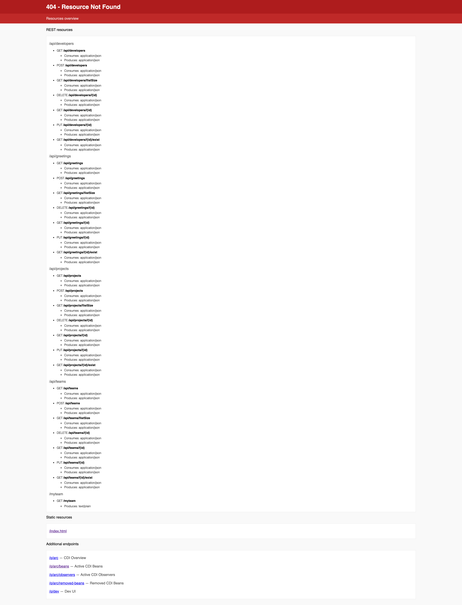

# Getting Started con Quarkus & Queryable
Un tutorial in italiano per mostrare come creare dei microservizi con QUARKUS utilizzando Queryable Maven Plugin.


## Getting Started
Immaginiamo di voler gestire 3 tabelle nel nostro database Postgresql, che verranno mappate con 3 entities e sarannno interrogabili via rest tramite 3 servizi rest.

I 3 entities:

- Team (uuid, name, tags)
- Developer (uuid, name, surname, team_uuid, active)
- Project (uuid, name, budget, developers_uuid)

Che saranno interrogabili (in GET, POST, PUT, DELETE), ai 3 indirizzi:

- http://localhost:8080/api/teams
- http://localhost:8080/api/developers
- http://localhost:8080/api/projects

### Prerequisiti

Cominciamo con la creazione di un progetto Quarkus, con le estensioni per Hibernate Panache, Resteasy e il ns Queryable. 
Comandi maven da eseguire in sequenza

```
mvn io.quarkus.platform:quarkus-maven-plugin:3.17.8:create \
        -DprojectGroupId=it.queryable \
        -DprojectArtifactId=myteam \
        -Dextensions="jdbc-postgresql,resteasy-jackson,hibernate-orm-panache" \
        -Dpath="/myteam" \
        -DnoCode
cd myteam

```

Abbiamo anche installato le varie estensioni Quarkus:

```
 jdbc-postgresql,resteasy-jackson,hibernate-orm-panache
```

Aggiungiamo la dipendenza Queryable al progetto ed installiamo le api rest:

```
./mvnw it.n-ess.queryable:queryable-maven-plugin:3.0.4:add
./mvnw queryable:install
```
### Siamo pronti per definire i nostri JPA Entities.

Le rotte dei nostri microservizi le definiamo in AppConstants:

```
package it.queryable.myteam.management;

public class AppConstants {
public static final String API_PATH = "/api";
public static final String DEVELOPERS_PATH = API_PATH + "/developers";
public static final String GREETING_PATH = API_PATH + "/greetings";
public static final String PROJECTS_PATH = API_PATH + "/projects";
public static final String TEAMS_PATH = API_PATH + "/teams";
}
```

#### Team

```
package it.queryable.myteam.model;

import io.quarkus.hibernate.orm.panache.PanacheEntityBase;
import it.ness.queryable.annotations.QLike;
import it.ness.queryable.annotations.QLikeList;
import it.ness.queryable.annotations.QList;
import it.ness.queryable.annotations.QOrderBy;
import jakarta.persistence.Entity;
import jakarta.persistence.Id;
import jakarta.persistence.Table;
import org.hibernate.annotations.UuidGenerator;

@Entity
@Table(name = "teams")
@QOrderBy("name asc")
public class Team extends PanacheEntityBase {

    @UuidGenerator
    @Id
    @QList
    public String uuid;

    @QLike
    public String name;

    @QLikeList
    public String tags;
}
```
#### Developer

```
package it.queryable.myteam.model;

import io.quarkus.hibernate.orm.panache.PanacheEntityBase;
import it.ness.queryable.annotations.*;

import jakarta.persistence.*;
import org.hibernate.annotations.GenericGenerator;


//    Developer (uuid, name, surname, team_uuid, active)


@Entity
@Table(name = "developers")
@QOrderBy("surname asc")
public class Developer extends PanacheEntityBase {

    @UuidGenerator
    @Id
    @QList
    public String uuid;

    @QLike
    public String name;

    @QLike
    public String surname;

    @QList
    public String team_uuid;

    @QLogicalDelete
    boolean active = true;
}
```
#### Project

```
package it.queryable.myteam.model;


import io.quarkus.hibernate.orm.panache.PanacheEntityBase;
import it.ness.queryable.annotations.*;
import org.hibernate.annotations.GenericGenerator;

import jakarta.persistence.*;

import java.math.BigDecimal;
import java.util.List;


// - Project (uuid, name, budget, developers_uuid)

@Entity
@Table(name = "projects")
@QOrderBy("name asc")
public class Project extends PanacheEntityBase {

    @UuidGenerator
    @Id
    @QList
    public String uuid;

    @QLike
    public String name;

    @Q
    public BigDecimal budget;

    @ElementCollection(fetch = FetchType.LAZY)
    public List<String> developers_uuid;

}
```


### Per generare le classi REST ed i filtri Hibernate nei nostri entities, lanciamo il comando:

```
./mvnw queryable:source
```

#### Un esempio di filtri generati:

```
@Entity
@Table(name = "teams")
@QOrderBy("name asc")
@FilterDef(name = "Team.like.tagses", parameters = @ParamDef(name = "tagses", type = String.class))
@Filter(name = "Team.like.tagses", condition = "lower(tagses) LIKE :tagses")
@FilterDef(name = "Team.obj.uuids", parameters = @ParamDef(name = "uuids", type = String.class))
@Filter(name = "Team.obj.uuids", condition = "uuid IN (:uuids)")
@FilterDef(name = "Team.like.name", parameters = @ParamDef(name = "name", type = String.class))
@Filter(name = "Team.like.name", condition = "lower(name) LIKE :name")
public class Team extends PanacheEntityBase {
```

#### E nella classe REST:

```
ect) {
		// field with @id
		return object.uuid;
	}

	@Override
	protected String getDefaultOrderBy() {
		return "name asc";
	}

	@Override
	public PanacheQuery<Team> getSearch(String orderBy) throws Exception {
		String query = null;
		Map<String, Object> params = null;
		if (nn("like.tagses")) {
			String[] tagses = get("like.tagses").split(",");
			StringBuilder sb = new StringBuilder();
			if (null == params) {
				params = new HashMap<>();
			}
			for (int i = 0; i < tagses.length; i++) {
				final String paramName = String.format("tags%d", i);
				sb.append(String.format("tags LIKE :%s", paramName));
				params.put(paramName, "%" + tagses[i] + "%");
				if (i < tagses.length - 1) {
					sb.append(" OR ");
				}
			}
			if (null == query) {
				query = sb.toString();
			} else {
				query = query + " OR " + sb.toString();
			}
		}
		PanacheQuery<Team> search;
		Sort sort = sort(orderBy);
		if (sort != null) {
			search = Team.find(query, sort, params);
		} else {
			search = Team.find(query, params);
		}
		if (nn("obj.uuids")) {
			search.filter("Team.obj.uuids", Parameters.with("uuids", asList("obj.uuids")));
		}
		if (nn("like.name")) {
			search.filter("Team.like.name", Parameters.with("name", likeParamToLowerCase("like.name")));
		}
		return search;
	}
}
```


A questo punto verranno generate le classi REST nel package it/queryable/myteam/service/rs/: 

- DeveloperServiceRs
- GreetingResource
- GreetingServiceRs
- ProjectServiceRs
- TeamServiceRs

Ed all'interno degli entities compariranno i filtri hibernate.

Per testare il progetto, dobbiamo aggiungere la configurazione (in application.properties) al ns db di test - lanciatro utilizzando docker-compose:

```
quarkus.datasource.db-kind=postgresql
quarkus.datasource.username=myteam
quarkus.datasource.password=myteam
quarkus.datasource.jdbc.url=jdbc:postgresql://localhost:5432/myteam
quarkus.hibernate-orm.database.generation=update
```

#### Nella cartella  /docker folder aggiungeremo il file docker-compose.yml :

```
services:
  postgresql:
    container_name: myteam
    image: postgres:14-alpine
    environment:
      POSTGRES_PASSWORD: myteam
      POSTGRES_USER: myteam
      POSTGRES_DB: myteam
    ports:
      - '5432:5432'
  pgadmin4:
    container_name: pgadmin4
    image: dpage/pgadmin4
    ports:
      - '80:80'
    links:
      - postgresql:postgresql
    depends_on:
      - postgresql
    environment:
      PGADMIN_DEFAULT_EMAIL: myteam@n-ess.it
      PGADMIN_DEFAULT_PASSWORD: myteam

```

#### Possiamo quindi lanciare il nostro database:

```
 docker compose -f docker/docker-compose.yml down
 docker compose -f docker/docker-compose.yml up -d
```

Ed infine:
```
 mvn compile quarkus:dev
```
#### Vedremo comparire nella shell, i seguenti logs:

```
[INFO] Scanning for projects...
[INFO]
[INFO] ------------------------< it.queryable:myteam >-------------------------
[INFO] Building myteam 1.0.0-SNAPSHOT
[INFO] --------------------------------[ jar ]---------------------------------
[INFO]
[INFO] --- quarkus-maven-plugin:1.12.1.Final:generate-code (default) @ myteam ---
[INFO]
[INFO] --- maven-resources-plugin:2.6:resources (default-resources) @ myteam ---
[INFO] Using 'UTF-8' encoding to copy filtered resources.
[INFO] Copying 2 resources
[INFO]
[INFO] --- maven-compiler-plugin:3.8.1:compile (default-compile) @ myteam ---
[INFO] Nothing to compile - all classes are up to date
[INFO]
[INFO] --- quarkus-maven-plugin:1.12.1.Final:dev (default-cli) @ myteam ---
Listening for transport dt_socket at address: 5005
__  ____  __  _____   ___  __ ____  ______
 --/ __ \/ / / / _ | / _ \/ //_/ / / / __/
 -/ /_/ / /_/ / __ |/ , _/ ,< / /_/ /\ \
--\___\_\____/_/ |_/_/|_/_/|_|\____/___/
2021-03-04 00:52:39,721 INFO  [io.quarkus] (Quarkus Main Thread) myteam 1.0.0-SNAPSHOT on JVM (powered by Quarkus 1.12.1.Final) started in 2.894s. Listening on: http://localhost:8080
2021-03-04 00:52:39,723 INFO  [io.quarkus] (Quarkus Main Thread) Profile dev activated. Live Coding activated.
2021-03-04 00:52:39,723 INFO  [io.quarkus] (Quarkus Main Thread) Installed features: [agroal, cdi, hibernate-orm, hibernate-orm-panache, jdbc-postgresql, mutiny, narayana-jta, resteasy, resteasy-jackson, smallrye-context-propagation]
```

La lista degli endpoint (visibile scrivendo un path inesistente: http://localhost:8080/xxx



## Proviamo a generare alcuni TEAMS:

```
curl --location --request POST 'http://localhost:8080/api/teams' \
--header 'Content-Type: application/json' \
--data-raw '{
    "name": "primo",
    "tags": "java,angular"
}'

curl --location --request POST 'http://localhost:8080/api/teams' \
--header 'Content-Type: application/json' \
--data-raw '{
    "name": "secondo",
    "tags": "typescrypt,react"
}'

curl --location --request POST 'http://localhost:8080/api/teams' \
--header 'Content-Type: application/json' \
--data-raw '{
    "name": "terzo",
    "tags": "scala,react"
}'
```

e vedremo nella SHELL:

```
2021-03-04 01:08:27,655 INFO  [it.que.myt.ser.rs.TeamServiceRs_Subclass] (executor-thread-1) persist
2021-03-04 01:08:27,772 INFO  [it.que.api.fil.CorsFilter] (executor-thread-1) POST - /api/teams
2021-03-04 01:10:20,104 INFO  [it.que.myt.ser.rs.TeamServiceRs_Subclass] (executor-thread-1) persist
2021-03-04 01:10:20,109 INFO  [it.que.api.fil.CorsFilter] (executor-thread-1) POST - /api/teams
2021-03-04 01:10:27,779 INFO  [it.que.myt.ser.rs.TeamServiceRs_Subclass] (executor-thread-1) persist
2021-03-04 01:10:27,787 INFO  [it.que.api.fil.CorsFilter] (executor-thread-1) POST - /api/teams
```

#### Proviamo a generare alcuni DEVELOPERS:

```
curl --location --request POST 'http://localhost:8080/api/developers' \
--header 'Content-Type: application/json' \
--data-raw '{
    "name": "fiorenzo",
    "surname": "pizza",
    "team_uuid": "081fa2b1-fffc-4797-81fc-cfb54a866fcf"
}'

curl --location --request POST 'http://localhost:8080/api/developers' \
--header 'Content-Type: application/json' \
--data-raw '{
    "name": "andrea",
    "surname": "rossi",
    "team_uuid": "081fa2b1-fffc-4797-81fc-cfb54a866fcf"
}'

curl --location --request POST 'http://localhost:8080/api/developers' \
--header 'Content-Type: application/json' \
--data-raw '{
    "name": "giovanni",
    "surname": "rana",
    "team_uuid": "081fa2b1-fffc-4797-81fc-cfb54a866fcf"
}'
```
e vedremo nella SHELL:
```
2021-03-04 01:16:39,492 INFO  [it.que.api.fil.CorsFilter] (executor-thread-1) POST - /api/developers
2021-03-04 01:17:10,242 INFO  [it.que.myt.ser.rs.DeveloperServiceRs_Subclass] (executor-thread-1) persist
2021-03-04 01:17:10,248 INFO  [it.que.api.fil.CorsFilter] (executor-thread-1) POST - /api/developers
2021-03-04 01:17:34,262 INFO  [it.que.myt.ser.rs.DeveloperServiceRs_Subclass] (executor-thread-1) persist
2021-03-04 01:17:34,267 INFO  [it.que.api.fil.CorsFilter] (executor-thread-1) POST - /api/developers
```

#### A questo punto, qualche query REST:

```
http://localhost:8080/api/developershttp://localhost:8080/api/developers?obj.uuid=0e158a58-5fa4-40f0-956f-ba61cd916e9c
http://localhost:8080/api/developers?like.surname=pi
http://localhost:8080/api/developers?obj.team_uuid=081fa2b1-fffc-4797-81fc-cfb54a866fcf

```

Buon divertimento con **QUARKUS & QUERYABLE**.

##  Qualche link utile:
- https://quarkus.io/guides/
- https://quarkus.io/guides/rest-json
- https://quarkus.io/guides/hibernate-orm-panache
- https://docs.jboss.org/hibernate/stable/core/userguide/html_single/Hibernate_User_Guide.html#pc-filter
- https://github.com/n-essio/queryable


## About @FilterDef types

The declared types:
- https://docs.jboss.org/hibernate/stable/core.old/reference/en/html/mapping-types.html
